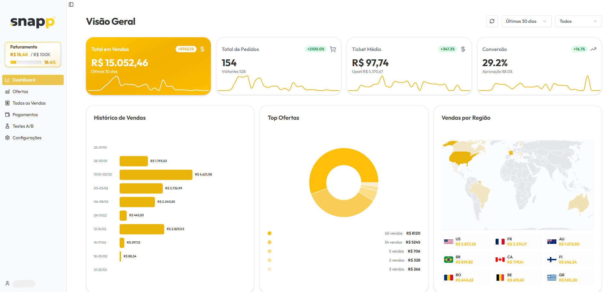

# 🚀 SnappCheckout: High-Performance Checkout

<p align="center">
  
  
  
  
  
</p>

<p align="center">
  <strong>Uma solução white-label de checkout de ultra-performance, com foco em conversão agressiva, testes A/B integrados e gestão inteligente de escala.</strong>
</p>

---

## 🎯 O que é o SnappCheckout?

O **SnappCheckout** é um ecossistema robusto projetado para o mercado de infoprodutos e e-commerce de alto volume. Ao contrário de checkouts convencionais, ele foi construído para remover toda a fricção do comprador, oferecendo uma experiência de pagamento fluida enquanto fornece ao administrador dados granulares para otimização de lucro (LTV).

Este projeto demonstra a implementação de fluxos financeiros complexos, sincronização de webhooks em tempo real e uma arquitetura escalável dividida em micro-serviços front-end e um core backend.

---

## 🖥️ Painel Administrativo (Backoffice)

Onde a gestão acontece. KPIs de receita, conversão de ofertas e gestão de vendas em tempo real.



---

## 🛒 Checkout Experience (End-user)

Interface otimizada para mobile, com carregamento instantâneo e suporte a múltiplos métodos de pagamento.

---

## ✨ Funcionalidades de Elite

### 📈 Conversão & Marketing

| Funcionalidade | Descrição |
|----------------|-----------|
| 🧪 **Testes A/B Nativos** | Rode variações de checkout simultâneas para descobrir qual design ou oferta converte mais |
| 🔥 **Order Bump & Upsell** | Aumente o ticket médio permitindo que o cliente adicione produtos complementares com um clique |
| 🌍 **Ecossistema Global** | Suporte multi-idioma (PT, EN, ES, FR) e conversão automática de moedas |
| 🎯 **Tracking Avançado** | Integração profunda com Facebook Pixel (Client & Server Side) e rastreamento completo de UTMs |

### 💳 Pagamentos & Segurança

| Funcionalidade | Descrição |
|----------------|-----------|
| 🔌 **Gateways Integrados** | Stripe, PayPal e Pagar.me (suporte completo a Pix, Cartão e Boleto) |
| 🛡️ **Resiliência Financeira** | Tratamento rigoroso de Webhooks para garantir que nenhuma venda seja perdida |
| 🔐 **Segurança** | Autenticação via JWT, proteção de rotas, Rate Limiting e criptografia de dados sensíveis |

### 🛠️ Gestão Técnica

| Funcionalidade | Descrição |
|----------------|-----------|
| 🐳 **Dockerizado** | Ambiente pronto para produção com isolamento total de processos |
| 📊 **Analytics** | Dashboard com gráficos de área, mapas de calor de vendas globais e tabelas de histórico detalhado |
| 🎨 **Customização Total** | Controle de cores, banners e textos diretamente pelo painel administrativo |

---

## 🛠️ Stack Tecnológica

| Camada | Tecnologias Utilizadas |
|--------|------------------------|
| **Frontend (Admin/Checkout)** | React 18, TypeScript, Vite, Tailwind CSS, Shadcn/UI |
| **Backend (Core API)** | Node.js, Express, TypeScript, MongoDB (Mongoose) |
| **DevOps** | Docker, Docker Compose, Nginx Config |
| **Terceiros** | Stripe SDK, PayPal SDK, Cloudinary (Assets), Postmark/Sendgrid |

---

## 🏗️ Estrutura do Projeto

A arquitetura foi pensada para **separação de responsabilidades (SoC)**, garantindo que o checkout seja leve para o cliente e o admin seja completo para o gestor.

```
snapp-checkout/
├── 📁 admin/                 # Interface administrativa (Gerenciamento de ofertas e métricas)
├── 📁 api/                   # API Restful principal (Lógica de negócio, pagamentos e DB)
├── 📁 checkout/              # Aplicação do cliente final (Foco em performance e conversão)
└── 🐳 docker-compose.yml     # Orquestração de containers
```

---

## 💡 Por que este projeto é relevante?

Este projeto prova competência em desafios reais de engenharia de software:

- **Arquitetura**: Separação clara entre cliente, admin e servidor
- **Integrações**: Manipulação de APIs de terceiros e fluxos assíncronos de pagamento
- **UX/UI**: Foco em Design System (Shadcn) e experiência do usuário mobile-first
- **Mentalidade de Produto**: O código não resolve apenas um problema técnico, ele resolve um problema de negócio (vender mais)

---

## 📫 Contato & Social

Desenvolvido com ☕ e 💻 por [Felipe Santos Marcelino](https://github.com/felipesantos5).

---

<p align="center">
  ⭐️ <strong>Se você gostou deste projeto, sinta-se à vontade para dar uma estrela!</strong>
</p>
